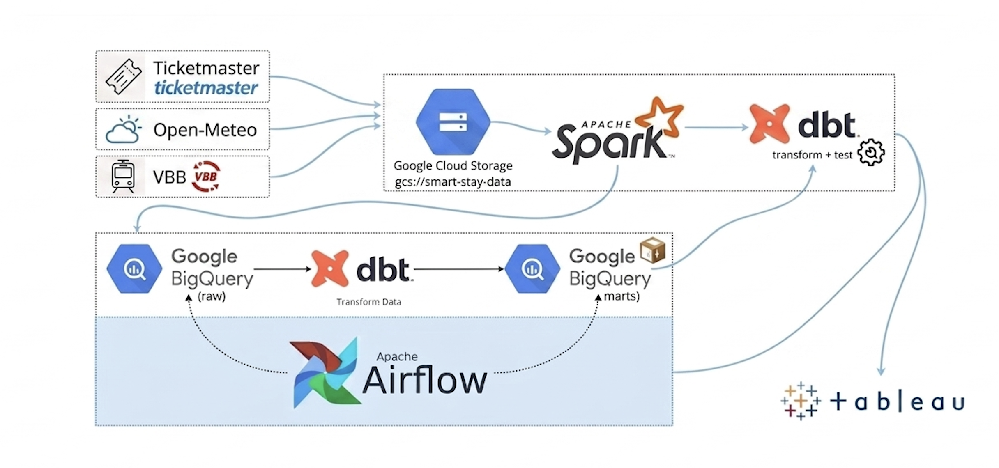
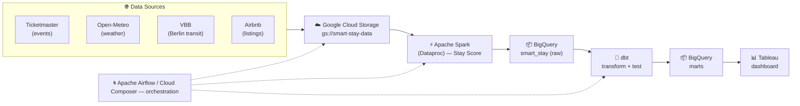

<h1 align="center">🏙️ Smart Stay</h1>
<p align="center">
  <b>A Berlin neighbourhood value &amp; connectivity advisor for short-term stays.</b><br>
  Cloud-native data engineering capstone · Built on Google Cloud Platform
</p>

<p align="center">
  
</p>

---

## 📌 Overview

**Smart Stay** helps travellers decide *where in Berlin to stay* by scoring every
neighbourhood on the trade-off that actually matters for a short trip: **value for
money vs. how well-connected you are.** It blends Airbnb pricing, VBB Berlin
transit density &amp; punctuality, weather, and upcoming events into a single,
ranked **Stay Score**, surfaced through an interactive Tableau dashboard.

The result is a fully automated, cloud-native pipeline that ingests raw data,
scores **99 neighbourhoods** (those with ≥ 15 active listings), transforms it in
the warehouse, and serves it to a decision-support dashboard.

---

## 🏗️ Architecture



The pipeline follows an **ingest → process → store → transform → serve**
flow, orchestrated on Google Cloud:

| Stage | Tooling | What happens |
|-------|---------|--------------|
| **Ingest** | Ticketmaster · Open-Meteo · VBB · Airbnb → **Google Cloud Storage** (`gs://smart-stay-data`) | Raw event, weather, transit & listing data lands in the bucket |
| **Process** | **Apache Spark** (Dataproc) | Cleans, joins & computes the neighbourhood **Stay Score** |
| **Store** | **Google BigQuery** (`smart_stay`, EU) | Scored data lands in the warehouse |
| **Transform** | **dbt** → **BigQuery** | Models, tests & business-ready marts |
| **Serve** | **Tableau** | Interactive decision dashboard |
| **Orchestrate** | **Apache Airflow** (Cloud Composer) | Schedules the end-to-end run |

### Scoring methodology

Two deliberate modelling choices drive the ranking:

- **15-listing minimum threshold** — neighbourhoods with fewer than 15 active
  listings are excluded (leaving 99 scored). This balances *coverage* against the
  *statistical noise* of tiny samples.
- **Log-scaled connectivity density** — a `log1p` transform is applied to
  departures-per-km² so that small, hyper-dense areas don't dominate scoring at
  the expense of larger, high-volume transit hubs.

Final Stay Scores range from **~9.9 to 94.0** across the 99 neighbourhoods.

---

## 📊 The Dashboard

An interactive Tableau workbook lets users filter by neighbourhood and explore
five analytical panels. Below is a walkthrough.

### 1 · Overview & KPIs — *Which neighbourhood is best for accommodation?*


Headline KPI tiles (active listings, average nightly price, DB punctuality,
upcoming events) plus a breakdown of neighbourhood archetypes. Most Berlin areas
are **Balanced** (good mix of price and access), while **Hidden Gems** are rare —
making them attractive value picks beyond the city centre.

### 2 · Price Drivers & Map — *What drives the price of a stay?*


A choropleth of median price by neighbourhood alongside a room-type breakdown.
**Entire homes** dominate the market; **hotel rooms** are the priciest but scarce,
while **shared and private rooms** are the budget end of the range.

### 3 · Neighbourhood Detail & Culture — *Where is Berlin's culture concentrated?*


A click-driven ranked table (Stay Score, Overall Rank, Median Price, Connectivity
&amp; Value scores, listing counts) plus an events-by-neighbourhood bar chart.
A handful of central areas — led by **Tiergarten Süd** and **Mierendorffplatz** —
host nearly all events; most areas are quiet.

### 4 · Busy Hours & Value vs. Connectivity


A **time-band heatmap** shows transit intensity across the day, and a
**quadrant scatter** plots every neighbourhood on Value vs. Connectivity:

- 🟢 **Hidden Gems** — affordable *and* well-connected
- 🟠 **Budget** — highly affordable, moderate connectivity
- 🔵 **Balanced** — affordable, moderate connectivity
- 🔴 **Premium / Central** — expensive but highly connected

---

## ⚙️ Tech Stack

| Layer | Technology |
|-------|-----------|
| Data sources | Ticketmaster (events) · Open-Meteo (weather) · VBB (Berlin transit) · Airbnb (listings) |
| Ingestion / Storage | Google Cloud Storage (`gs://smart-stay-data`) |
| Processing | Apache Spark (Dataproc, `europe-west3`) |
| Warehouse | Google BigQuery — dataset `smart_stay` (EU) |
| Transformation | dbt Cloud |
| Orchestration | Apache Airflow / Cloud Composer |
| Visualisation | Tableau |

---

## 🚀 Pipeline Run

The standard end-to-end execution sequence:

```bash
# 1. Verify the Spark scoring script compiles
python -m py_compile spark_scores.py

# 2. Stage the script in GCS
gsutil cp spark_scores.py gs://smart-stay-data/scripts/

# 3. Submit the Spark batch to Dataproc
gcloud dataproc batches submit pyspark \
  gs://smart-stay-data/scripts/spark_scores.py \
  --region=europe-west3

# 4. Wait for SUCCESS, then trigger the dbt transformation job
curl -X POST \
  "https://cloud.getdbt.com/api/v2/accounts/70506183137732/jobs/70506183132991/run/" \
  -H "Authorization: Token $DBT_API_TOKEN" \
  -H "Content-Type: application/json" \
  -d '{"cause": "Triggered after Spark scoring run"}'
```

---

## 📁 Key Components

| Script | Purpose |
|--------|---------|
| `spark_scores.py` | Core scoring pipeline — 15-listing threshold, `log1p` connectivity scaling → 99 scored neighbourhoods |
| `departures_by_hour.py` | Surfaces hourly transit data into `smart_stay.departures_by_hour` for the heatmap panel |
| dbt models | Warehouse transformations & business-ready marts in BigQuery |

---

## 🎓 About

Cloud-native data engineering capstone project, **SRH Heidelberg**.

<p align="center"><i>Built with GCP, Spark, dbt & Tableau.</i></p>
